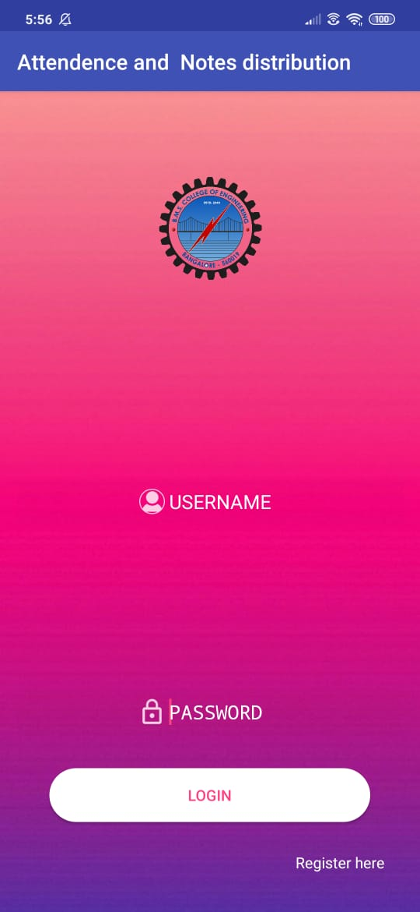

# Mobile-Application-Development

## Notes Distribution And Attendance App

>Designing a mobile application to solve the problem faced during conventional notes distribution and attendance marking.

### USERS
* **TEACHER**
* **STUDENT**
* **PARENT**

### FUNCTIONALITY
* **TEACHER**
1)ADD/UPDATE/DELETE STUDENT
2)ADD/UPDATE/DELETE PARENT
3)NOTES DISTRIBUTION 
4)MARK ATTENDANCE
5)BROADCAST MESSAGE

* **STUDENT**
1)VIEW ATTENDANCE
2)VIEW NOTES

* **PARENT**
1)VIEW ATTENDANCE
2)RECEIVE ATTENDANCE SHORTAGE ALERT

> **OVERVIEW**
  
  
  
  

